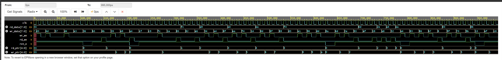

# UVM Synchronous FIFO Verification

UVM testbench for a 16-deep synchronous FIFO (8/32-bit data width).

## Structure
- `rtl/`       : DUT (sync_fifo.sv)
- `tb/`        : UVM components (interface, package, top, tests)
- `sim/`       : Scripts/Makefile for running simulations

## Status
- [X] DUT complete
- [X] Basic UVM env
- [ ] Coverage & scoreboard

Tools: Questa/VCS/EDA Playground
