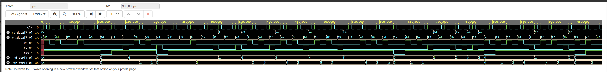

# UVM Synchronous FIFO Verification

UVM testbench for a 16-deep synchronous FIFO (8-bit data width).

### Coverpoints

- `wr_en` 
- `rd_en`    
- `full`  
- `empty`
- `cross wr_en,full`
- `cross rd_en,empty`

    
Functional coverage: 100%
## Structure
- `rtl/`       : DUT (sync_fifo.sv)
- `tb/`        : UVM components (interface, package, top, tests)
- `sim/`       : Scripts/Makefile for running simulations

## Status
- [X] DUT complete
- [X] Basic UVM env
- [X] Coverage & scoreboard

Tools: Questa/VCS/EDA Playground
